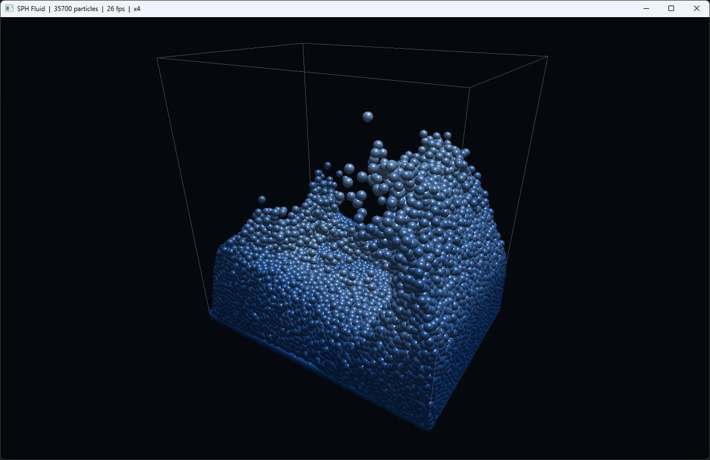

# SPH Fluid

A 3D water simulator written from scratch in C++. The water is thousands of
particles pulling on each other; there's no game engine and no physics library
doing the work. The only outside code in the project opens a window and talks to
OpenGL.

I wrote it to understand how fluids are actually simulated, instead of wrapping
someone else's solver.



## How it works

The fluid is a cloud of particles. Each one carries mass and velocity, and the
smooth, continuous quantities of real water — density, pressure, the forces
between blobs of fluid — are rebuilt by summing smooth kernels over nearby
particles. That's the whole idea behind SPH (Smoothed Particle Hydrodynamics).

The parts that actually matter for getting water that behaves:

- **Density** comes from the poly6 kernel.
- **Pressure** uses a stiff Tait equation of state, `p ∝ (ρ/ρ₀)⁷ − 1`. The steep
  exponent is what stops the water from squashing: density stays within a few
  percent of rest instead of collapsing.
- **Stability** comes from Monaghan artificial viscosity, which bleeds off energy
  when particles rush together. Without it, a dropped column of water doesn't
  settle, it detonates.
- **Neighbours** are found with a uniform spatial-hash grid (cell size = the
  smoothing radius, built with a counting sort), so each step costs O(N) instead
  of O(N²).
- **Time stepping** is semi-implicit Euler at a CFL-limited step.

There's also a thin repulsive cushion at the tank walls. Particles next to a wall
are missing the neighbours that would sit on the other side of it, so their
density reads low and the wall never pushes back. Left alone, sloshing water
climbs the walls and sticks there. The cushion (plus a little drag in the
boundary layer) fixes it.

Particles are drawn as small lit spheres, blue when calm and white where the
water moves fast, inside a wireframe tank.

## Build

### Visual Studio (Windows)

Open `SphFluidViewer.sln`, set the configuration to **Release | x64**, and run
(`Ctrl+F5`). No external dependencies — it links only `opengl32`, `gdi32` and
`user32` from the Windows SDK, and loads the OpenGL functions it needs at
runtime. Run on a machine with real GPU drivers (over Remote Desktop there's no
OpenGL 3.3).

### CMake (cross-platform)

```bash
cmake -B build -DCMAKE_BUILD_TYPE=Release
cmake --build build -j
./build/sph_fluid        # viewer
./build/verify           # headless core check, no GPU needed
```

CMake pulls GLFW and GLAD automatically, so there's nothing to install by hand.
Needs a C++20 compiler.

## Controls

| Input        | Action                            |
|--------------|-----------------------------------|
| left-drag    | orbit the camera                  |
| mouse wheel  | zoom                              |
| `Space`      | pause / resume                    |
| `↑` / `↓`    | simulation speed (substeps/frame) |
| `R`          | reset the dam-break               |
| `M`          | toggle reconstructed surface / particles |
| `P`          | overlay particles in surface mode |
| `F`          | toggle foam/spray overlay in surface mode |
| `O`          | toggle a solid sphere obstacle and restart the scenario |
| `H`          | toggle the in-window HUD overlay       |
| `Esc`        | quit                              |

## What I checked

The `verify` build runs without a GPU and sanity-checks the core:

- the grid returns exactly the same neighbours as a brute-force O(N²) scan;
- under a dam-break, peak density stays within a few percent of rest, so the
  fluid really is close to incompressible;
- kinetic energy rises as the column falls and then decays as it settles,
  instead of growing forever, which is the difference between a stable scheme and
  one that's quietly adding energy.

## Layout

```
src/vec3.hpp      hand-rolled 3D vector
src/mat4.hpp      column-major matrix + orbital camera
src/kernels.hpp   SPH smoothing kernels
src/grid.hpp      uniform spatial-hash grid
src/sph.hpp/.cpp  the solver: density, pressure, forces, integration
src/viewer_*.cpp  OpenGL viewers (native Win32, and GLFW for CMake)
src/verify.cpp    headless core check
```

## License

MIT.


## Surface rendering

The Win32 viewer now contains a CPU iso-surface reconstruction pass for the SPH particles.
It samples a compact scalar field around the particles, extracts a triangle mesh on a regular 3D grid, and renders it with a separate OpenGL shader.

Controls:

- `M` toggles between the reconstructed surface and the original particle-sphere view.
- `P` overlays the particles while the surface view is active.
- `F` toggles the cheap foam/spray overlay in surface mode.
- `O` toggles a solid sphere obstacle in the tank and restarts the dam-break, so the water has something to wrap around and collide with.
- `H` toggles the HUD overlay with FPS, particle count, mode flags and controls.

Visual pass added after the first surface build:

- the water surface shader now uses camera-dependent Fresnel rim light, tighter specular highlights, and height-based deep/shallow water tinting;
- fast particles near the free surface are rendered as small bright point sprites, giving splashes and foam without changing the solver;
- the window title shows whether foam overlay is active.

Implementation notes:

- The scalar field is deposited only within a small radius around each particle, so the build cost scales with particle count and local grid density rather than with every particle at every grid sample.
- The extraction uses a cube grid subdivided into tetrahedra to avoid the large 256-case marching-cubes lookup table while producing the same kind of iso-surface mesh.
- The surface mesh is rebuilt every second rendered frame by default; change `surfaceBuildStride`, `cell`, `radius`, and `iso` in `viewer_win32.cpp` to tune quality/performance.


## Obstacle pass

This version adds a simple solid sphere collider to the SPH solver and renders it as a wireframe obstacle in the tank. It is intentionally implemented in the solver rather than as a post-render trick: particles are projected out of the sphere during integration, their normal velocity is damped/reflected, and tangential velocity is reduced by a simple friction term.

Press `O` to restart the dam-break with the obstacle enabled or disabled. This gives a more interesting video scenario than an empty box: the collapsing water column hits the sphere, splits around it, forms splashes, and then settles back into the pool.

Implementation notes:

- obstacle parameters live in `SphParams` (`sphereCenter`, `sphereRadius`, `sphereRestitution`, `sphereFriction`);
- collision handling happens in `Sph::integrate()` after wall constraints;
- the Win32 viewer draws the obstacle as three wire rings appended to the existing tank line buffer;
- this is a collider, not a sampled boundary particle model, so it is cheap and stable but still visually approximate near the sphere surface.


## HUD pass

This version adds an in-window HUD to the native Win32 viewer. The overlay is drawn on top of the OpenGL scene and shows the current FPS, particle count, simulation speed, active render mode, pause state, surface vertex count, and the most important controls.

Press `H` to hide or show the HUD. The window title still contains the compact status line, but the HUD makes recorded videos and screenshots easier to understand without relying on external captions.

## Support

If you found this project interesting or useful, you can support my work:

[](https://github.com/sponsors/makarov-mm)